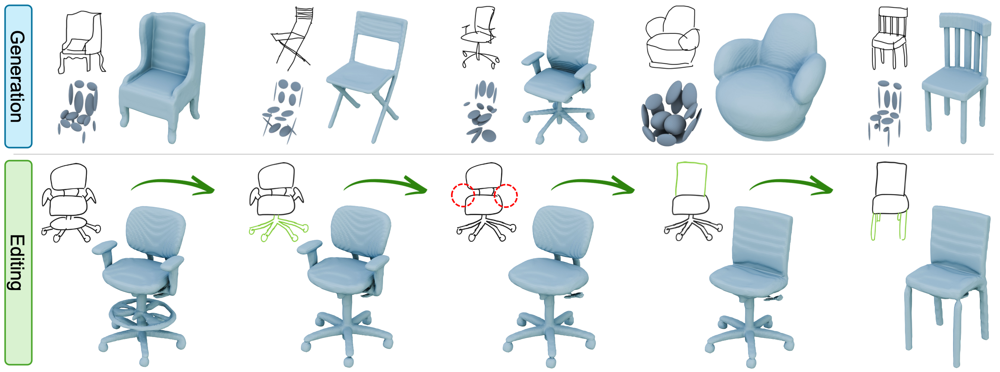

# PASTA: Part-Aware Sketch-to-3D Shape Generation with Text-Aligned Prior

🚀 Official PyTorch Implementation of **PASTA** — *Accepted to ICCV 2025* 🎉  



## Abstract
A fundamental challenge in conditional 3D shape generation is to minimize the information loss and maximize the intention of user input. Existing approaches have predominantly focused on two types of isolated conditional signals, i.e., user sketches and text descriptions, each of which does not offer flexible control of the generated shape. In this paper, we introduce PASTA, the flexible approach that seamlessly integrates a user sketch and a text description for 3D shape generation. The key idea is to use text embeddings from a vision-language model to enrich the semantic representation of sketches. Specifically, these text-derived priors specify the part components of the object, compensating for missing visual cues from ambiguous sketches. In addition, we introduce ISG-Net which employs two types of graph convolutional networks: IndivGCN, which processes fine-grained details, and PartGCN, which aggregates these details into parts and refines the structure of objects. Extensive experiments demonstrate that PASTA outperforms existing methods in part-level editing and achieves state-of-the-art results in sketch-to-3D shape generation.

## Acuiring Datasets

Our PASTA is trained on the same datasets as SENS. To obtain the dataset, please refer to SENS’s GitHub repository: [https://github.com/AlexandreBinninger/SENS].

We employ a subset of the ShapeNet dataset along with the corresponding sketches. For evaluation, we conduct two experiments for the chair category. First, we utilize the AmateurSketch-3D dataset containing 1,000 chair shapes along with corresponding hand-drawn sketches from three different viewpoints. Second, we evaluate 500 chair shapes on the expert-drawn sketch dataset, ProSketch-3D, which provides more detailed representations.

To obtain the AmateurSketch-3D and ProSketch-3D datasets used in our model’s evaluation, please visit the [SketchX](https://sketchx.eecs.qmul.ac.uk/downloads/) website.


### Installation

Our model was trained and tested in the following environment.
* Ubuntu 20.04
* Python 3.9
* CUDA 12.1
* PyTorch 2.0.1

By running the code below, you can easily set up a conda environment:

```bash
conda env create -f environment.yml
conda activate pasta
```


### CLI

We provide an easy script for running the program on one input image in `run.py`. Use this to check your current installation, or for an offline skecth-to-shape pipeline.

`python run.py --input sketch.png`

An example sketch.png is provided. Results are saved in `assets/output`.

### Sketching interface

#### Launching

After following the installation instructions (be sure to run ```export PYTHONPATH=.```), from the root of the project run
```python ui_sketch/sketch_main.py```

You should see a window appear. There are two panels: the left one displays the resulting shape, the right one is where you can draw. Commands are to be found below.

#### Commands

You can draw on the right panel via **right-click**. To switch between erasing and drawing, click on the pencil icon. To generate a shape from the drawing, click on the shredder icon. You can rotate the mesh using left-click, and use the wheel to zoom-in/zoom-out. Click on the shape outline to get an outline rendering of the mesh. The outline rendering will correspond to the position and rotation of the mesh on the left, and the zoom level will influence the thickness of the stroke.

To select parts of the mesh, use the right-click. Selected parts are in orange. Use the hammer icon to regenerate the corresponding parts of the latent code. By modifying the drawing and clicking on the cube-with-orange-top icon, you will only modify the selected parts of the current mesh.

To save the current mesh to `assets/tmp/`, press ENTER. The program will also save your sketch at each stroke that you draw.


### Training

Download the dataset and extract it the `assets/data/` folder. You should have a folder `assets/data/dataset_chair_preprocess`. Then, simply launch
```python trainer_combined.py```

Alternatively, you can proceed with training by executing the shell as shown below.:

```bash
sh train.sh
```

### Download

We provide the following resources for reproducing our results and running inference:

- 🔗 **Pretrained Checkpoint**: [Download model checkpoint](https://kuaicv.synology.me/iccv2025/PASTA/model)  
  Use this for testing and inference with `eval.py`.

- 📝 **AmateurSketch-3D LLaVA Features**: [Download shapenet_amateur.zip](https://kuaicv.synology.me/iccv2025/PASTA/shapenet_amateur.zip)  
  This zip file contains LLaVA-7B features for the AmateurSketch-3D dataset used in our evaluation.


### Citation

If you find our work useful in your research, please consider citing:

```bibtex
@article{lee2025pasta,
  title={PASTA: Part-Aware Sketch-to-3D Shape Generation with Text-Aligned Prior},
  author={Lee, Seunggwan and Jung, Hwanhee and Koh, Byoungsoo and Huang, Qixing and Yoon, Sangho and Kim, Sangpil},
  journal={arXiv preprint arXiv:2503.12834},
  year={2025}
}
